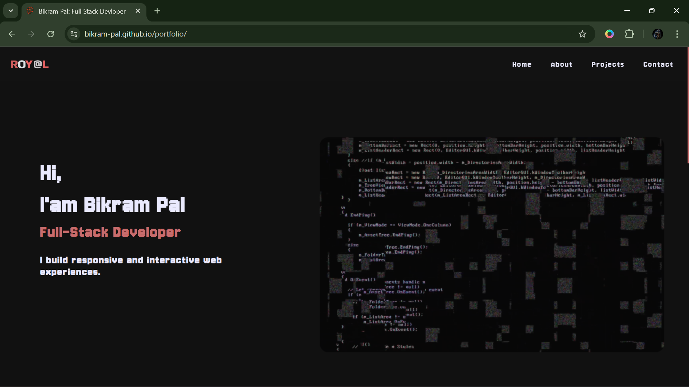

# 🚀 Bikram Pal – Developer Portfolio

A modern, responsive, and animated personal portfolio website built using **HTML, CSS, JavaScript, and GSAP**.  
This portfolio showcases my skills, projects, and contact information with smooth animations and a clean UI.

🌐 **Live Demo:**  
👉 https://bikram-pal.github.io/portfolio/

---
## 📸 Screenshots

### Desktop View


### About Section


### Mobile View

## 🎥 Demo Video

https://github.com/Bikram-pal/portfolio/screenshort/videoclip.mp4

---
## ✨ Features

- Fully responsive design (mobile, tablet, desktop)
- Smooth animations using **GSAP**
- Scroll-based animations with **ScrollTrigger**
- Animated typing effect for role title
- Mobile-friendly hamburger navigation menu
- Scroll spy navigation (active link highlighting)
- Custom fonts and styled scrollbar
- Clean and minimal UI design

---

## 🛠 Tech Stack

- **HTML5**
- **CSS3**
- **JavaScript (Vanilla JS)**
- **GSAP (GreenSock Animation Platform)**
- **GSAP ScrollTrigger**
- **Custom Fonts**

---

## 📂 Project Structure

```bash
portfolio/
│── index.html
│── style.css
│── script.js
│── screenshort
│── font/
│   └── Jersey10-Regular.ttf
│── icons/
│── assets/
│── README.md

```

---

## ⚙️ Installation & Setup

1. Clone the repository:
   ```bash
   git clone https://github.com/Bikram-pal/portfolio.git
   ```

2. Navigate to the project folder:
   ```bash
   cd portfolio
   ```

3. Open `index.html` in your browser  
   *(No backend, build tools, or dependencies required)*

---

## 📌 Sections Included

- **Home** – Introduction with animated role text
- **About** – Personal background and skills
- **Projects** – Portfolio projects showcase
- **Contact** – Email, phone, GitHub & LinkedIn

---

## 📦 Libraries Used

- **GSAP**  
  https://cdnjs.cloudflare.com/ajax/libs/gsap/3.13.0/gsap.min.js

- **ScrollTrigger**  
  https://cdnjs.cloudflare.com/ajax/libs/gsap/3.13.0/ScrollTrigger.min.js

---

## 📱 Responsive Design

Optimized for:
- Desktop screens
- Tablets
- Mobile devices  

Uses multiple media queries for smooth responsiveness.

---

## 🚀 Future Improvements

- Add backend contact form
- Add more projects section
- Dark / Light mode toggle
- SEO optimization
- Performance improvements

---

## 👤 Author

**Bikram Pal**

- GitHub: https://github.com/Bikram-pal  
- LinkedIn: https://www.linkedin.com/in/bikram-pal-798b252b1/  
- Email: palbikram557@gmail.com  

---

## 📜 License

This project is open-source and free to use for learning and personal portfolio purposes.
